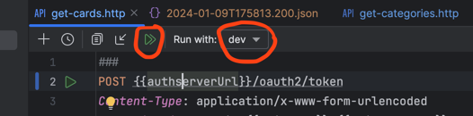

# Hyperskill Community Project: Flashcards

Project idea came up in the Hyperskill community team and will be realized by this team.

## Usage

### Run the app
To run the application including startup of MongoDB container, use the stored Run configuration in IntelliJ IDEA.
You can transfer it to the Service tool window for convenience via Add Service -> Run configuration -> Spring.

Alternatively run the following command:

```shell
./gradlew bootRunFlashcards
```

#### NOTE:
The authserver docker image is now provided for AMD64 and ARM64 architecture. The build selects the right image
by copying the compose.yaml file for the respective architecture from the docker folder into root directory.

#### Behaviour: 
To access the app see the video in .dev folder: [Accessing the app](.dev/assets/run-flashcards.mp4)

You need to **access the flashcards-website now via http://127.0.0.1:8080 context path**, as oauth2 demands a 
different host URLs for the login request (which is localhost of course).
The browser immediately redirects you to the authserver http://localhost:8000/login and after inserting credentials
(of one of the test users - OR a newly registered user - via http://127.0.0.1:8080/registration.html for now) you are
accessing the landing page - or whatever page was requested of our Vue frontend. (Authorization Code flow)
The browser keeps the oauth token as cookie (and refreshes it on demand, if user actively uses the websites) with an
expiration date, I set to 15 min. After expiration and no refresh, accessing a website will redirect to login page again.

To start the auth-server standalone for development purposes, you need to start mongodb-container manually first
(as usage of spring-docker-compose would conflict) and then use Run configuration "AuthServerApplication" in IntelliJ IDEA; 
or whatever method you prefer. It will automatically connect to localhost:27017 if no MONGO_HOST environment variable is set.

### Run requests against the app (development)
Recommended way is to use the **IntelliJ IDEA http-client**.
It's located in .dev folder. But it seems Ultimate Edition only as of now.

To use the client, you have to 
- select an environment - I provided dev (and empty prod for future)
- run with double-arrow on top to chain token and get/post call. (see picture)

NOTE: The token generated by the http-client currently has no subject.

#### Alternatively using postman:
Type client_id and client_secret into the Authorization tab of the request choosing Basic Authentification.
Then switch to the Body tab and choose x-www-form-urlencoded and add key-value pair
> grant_type: client_credentials

Then submit as POST-request to http://localhost:8000/oauth2/token and you will get a token in the response body.
```json
{
    "access_token": "eyJra<......>kV78Q",
    "token_type": "Bearer",
    "expires_in": 599
}
```
Copy the access_token and paste it into the Authorization tab of the request choosing Bearer Token.
Then submit your request of choice to the flashcards app.

### Purge docker resources (mongo-data volume and mongo container)
Take care, running this  script deletes all persistent data of the mongo container.
```shell
.dev/remove-mongo-volume.sh
```

### Setup and usage of SonarQube

#### One-time setup
To start working with sonarQube, run the following script - just with the double-arrow at the gutter.
It pulls necessary containers (if not present - so expect some time), starts up a SonarQube server in a network
together with a Postgres database to persist sonar projects.
Then it creates a sonar project (presently only flashcards-server) and a token for the project.  
**The script instructs you to copy the token to the gradle.properties file in the root directory of the project.**
At the end you are presented with the URL of the new sonar project.

**NOTE: The script will ask for an admin password for the sonar server. First time after container pull,
this is the default password `admin`. You should change it afterwards.**

```shell
.dev/sonar-first-setup.sh
```

#### Usage
Afterwards you can run the sonar scan and analyze the server project with
> ./gradlew :sonar

respectively by clicking the task under verification in the gradle tool window.


## Technology / External Libraries

- Java 21
- Spring Boot 3.2.1
- Mongo DB and Spring Authorization-server containerized via docker-compose
- Vue 3 SPA-Frontend using component framework Vuetify 3
- Packaging with Vite
- Lombok
- Testcontainers
- Gradle 8.5
- Support for Native image on GraalVM (currently only arch-server)

## Program description

The application represents a digital flashcard app, that allows to create, store and retrieve flashcards via REST-endpoints.

Flash cards are stored in collections of a mongo database. A collection is a set of flashcards with a name and a description.

## Project status

Ongoing

## Repository Contents

Sources for backend and frontend gradle modules with tests and configurations (to come up).
