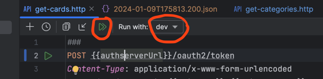

# Hyperskill Community Project: Flashcards

Project idea came up in the Hyperskill community team and will be realized by this team.

## Usage

### Run the app
To run the application including startup of MongoDB container, use the stored Run configuration in IntelliJ IDEA.
You can transfer it to the Service tool window for convenience via Add Service -> Run configuration -> Spring.

To access the app see also the video in .dev folder: [Accessing the app](.dev/run-flashcards.mp4)

Alternatively run the following command:

```shell
./gradlew bootRunFlashcards
```
#### NOTE:
Currently the authserver docker image is only provided for ARM64 architecture (Apple M1 chip) and will not run on Intel
architecture. If you are on Intel architecture, you need to build your own docker image in AMD64 
or start the AuthServerApplication before running the flashcards app 
(in the latter case you will need to modify the compose.yml also to not run the authserver container).

#### Behaviour: 
You need to **access the flashcards-website now via http://127.0.0.1:8080 context path**, as oauth2 demands a 
different host URLs for the login request (which is localhost of course).
The browser immediately redirects you to the authserver http://localhost:8000/login and after inserting credentials
(of one of the test users - OR a newly registered user - via http://127.0.0.1:8080/registration.html for now) you are
accessing the landing page - or whatever page was requested of our Vue frontend. (Authorization Code flow)
The browser keeps the oauth token as cookie (and refreshes it on demand, if user actively uses the websites) with an
expiration date, I set to 15 min. After expiration and no refresh, accessing a website will redirect to login page again.

To start the auth-server standalone for development purposes, you need to start mongodb-container manually first
(as usage of spring-docker-compose would conflict) and then use Run configuration "AuthServerApplication" in IntelliJ IDEA; 
or whatever method you prefer. It will automatically connect to localhost:27017 if no MONGO_HOST environment variable is set.

### Run requests against the app (development)
Recommended way is to use the **IntelliJ IDEA http-client**.
It's located in .dev folder. But it seems Ultimate Edition only as of now.

To use the client, you have to 
- select an environment - I provided dev (and empty prod for future)
- run with double-arrow on top to chain token and get/post call. (see picture)


#### Alternatively using postman:
Type client_id and client_secret into the Authorization tab of the request choosing Basic Authentification.
Then switch to the Body tab and choose x-www-form-urlencoded and add key-value pair
> grant_type: client_credentials

Then submit as POST-request to http://localhost:8000/oauth2/token and you will get a token in the response body.
```json
{
    "access_token": "eyJra<......>kV78Q",
    "token_type": "Bearer",
    "expires_in": 599
}
```
Copy the access_token and paste it into the Authorization tab of the request choosing Bearer Token.
Then submit your request of choice to the flashcards app.

### Purge docker resources (mongo-data volume and mongo container)
Take care, running this  script deletes all persistent data of the mongo container.
```shell
.dev/remove-mongo-volume.sh
```

## Technology / External Libraries

- Java 21
- Spring Boot 3.2.1
- Mongo DB via docker-compose
- Vue 3 SPA-Frontend using component framework Vuetify 3
- Packaging with Vite
- Lombok
- Testcontainers
- Gradle 8.5

[//]: # (- Support for Native image on GraalVM)

## Program description

The application represents a digital flashcard app, that allows to create, store and retrieve flashcards via REST-endpoints.

Flash cards are stored in collections of a mongo database. A collection is a set of flashcards with a name and a description.

## Project status

Ongoing

## Repository Contents

Sources for backend and frontend gradle modules with tests and configurations (to come up).

## Progress

01.01.24 Project started. Just setup of build and repo with gradle.

02.01.24 Backend now with User management into Collection in cards databas of MongoDB. Change frontend build to download
node 21.5 into local .gradle folder - to avoid relying on node installation on executable location.
